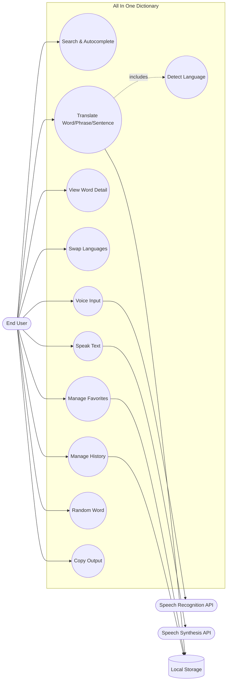

# Use Case Diagram

## System
**All In One Dictionary** (offline multilingual dictionary and translator)

## Actors
- **End User**
- **Browser Speech Recognition API**
- **Browser Speech Synthesis API**
- **Browser Local Storage**

## Diagram

## Implementation Mapping
- UI logic: `project/src/App.tsx`
- Core use case behavior: `project/src/utils/engine.ts`
- Dictionary/phrase source data: `project/src/data/dictionary.ts`
