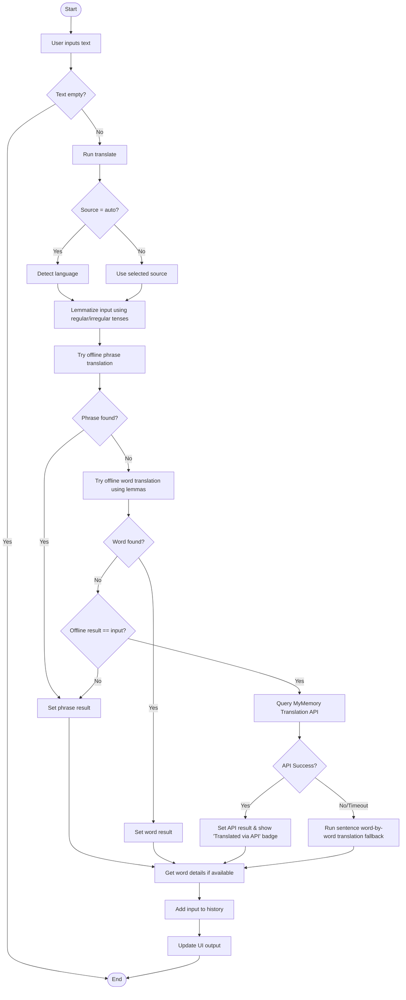
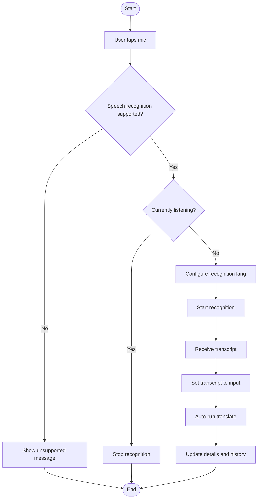
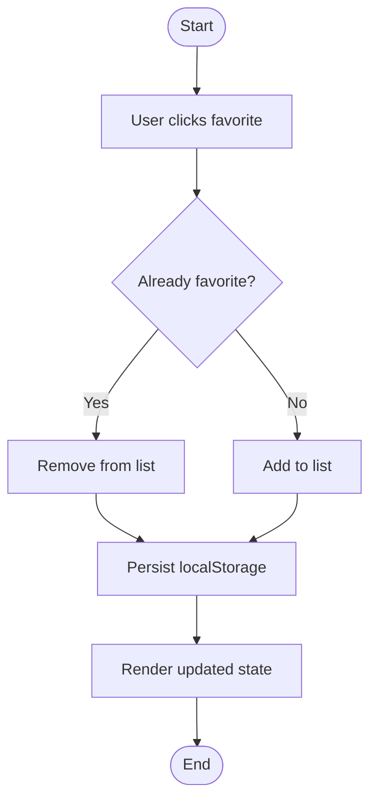

# Activity Diagrams

## AD-01 Translation Workflow

```mermaid
flowchart TD
    A([Start]) --> B[User inputs text]
    B --> C{Text empty?}
    C -- Yes --> Z([End])
    C -- No --> D[Run translate]
    D --> E{Source = auto?}
    E -- Yes --> F[Detect language]
    E -- No --> G[Use selected source]
    F --> H[Lemmatize input using regular/irregular tenses]
    G --> H
    H --> I[Try offline phrase translation]
    I --> J{Phrase found?}
    J -- Yes --> K[Set phrase result]
    J -- No --> L[Try offline word translation using lemmas]
    L --> M{Word found?}
    M -- Yes --> N[Set word result]
    M -- No --> O{Offline result == input?}
    
    O -- Yes --> P[Query MyMemory Translation API]
    P --> Q{API Success?}
    Q -- Yes --> R[Set API result & show 'Translated via API' badge]
    Q -- No/Timeout --> S[Run sentence word-by-word translation fallback]
    
    O -- No --> K
    
    K --> T[Get word details if available]
    N --> T
    R --> T
    S --> T
    
    T --> U[Add input to history]
    U --> V[Update UI output]
    V --> Z
```

## AD-02 Voice Input Workflow

```mermaid
flowchart TD
    A([Start]) --> B[User taps mic]
    B --> C{Speech recognition supported?}
    C -- No --> D[Show unsupported message] --> Z([End])
    C -- Yes --> E{Currently listening?}
    E -- Yes --> F[Stop recognition] --> Z
    E -- No --> G[Configure recognition lang]
    G --> H[Start recognition]
    H --> I[Receive transcript]
    I --> J[Set transcript to input]
    J --> K[Auto-run translate]
    K --> L[Update details and history]
    L --> Z
```

## AD-03 Favorite Toggle Workflow

```mermaid
flowchart TD
    A([Start]) --> B[User clicks favorite]
    B --> C{Already favorite?}
    C -- Yes --> D[Remove from list]
    C -- No --> E[Add to list]
    D --> F[Persist localStorage]
    E --> F
    F --> G[Render updated state]
    G --> Z([End])
```
