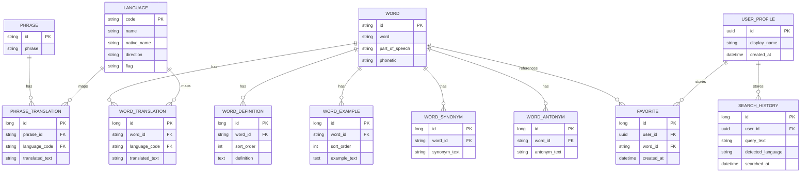

# Entity Relationship Diagram

## Purpose
Relational target model for scaling beyond local in-browser storage.

## ERD

```mermaid
erDiagram
    LANGUAGE ||--o{ WORD_TRANSLATION : maps
    LANGUAGE ||--o{ PHRASE_TRANSLATION : maps

    WORD ||--o{ WORD_DEFINITION : has
    WORD ||--o{ WORD_EXAMPLE : has
    WORD ||--o{ WORD_TRANSLATION : has
    WORD ||--o{ WORD_SYNONYM : has
    WORD ||--o{ WORD_ANTONYM : has

    PHRASE ||--o{ PHRASE_TRANSLATION : has

    USER_PROFILE ||--o{ FAVORITE : stores
    USER_PROFILE ||--o{ SEARCH_HISTORY : stores
    WORD ||--o{ FAVORITE : references

    LANGUAGE {
      string code PK
      string name
      string native_name
      string direction
      string flag
    }

    WORD {
      string id PK
      string word
      string part_of_speech
      string phonetic
    }

    WORD_DEFINITION {
      long id PK
      string word_id FK
      int sort_order
      text definition
    }

    WORD_EXAMPLE {
      long id PK
      string word_id FK
      int sort_order
      text example_text
    }

    WORD_TRANSLATION {
      long id PK
      string word_id FK
      string language_code FK
      string translated_text
    }

    WORD_SYNONYM {
      long id PK
      string word_id FK
      string synonym_text
    }

    WORD_ANTONYM {
      long id PK
      string word_id FK
      string antonym_text
    }

    PHRASE {
      string id PK
      string phrase
    }

    PHRASE_TRANSLATION {
      long id PK
      string phrase_id FK
      string language_code FK
      string translated_text
    }

    USER_PROFILE {
      uuid id PK
      string display_name
      datetime created_at
    }

    FAVORITE {
      long id PK
      uuid user_id FK
      string word_id FK
      datetime created_at
    }

    SEARCH_HISTORY {
      long id PK
      uuid user_id FK
      string query_text
      string detected_language
      datetime searched_at
    }
```
