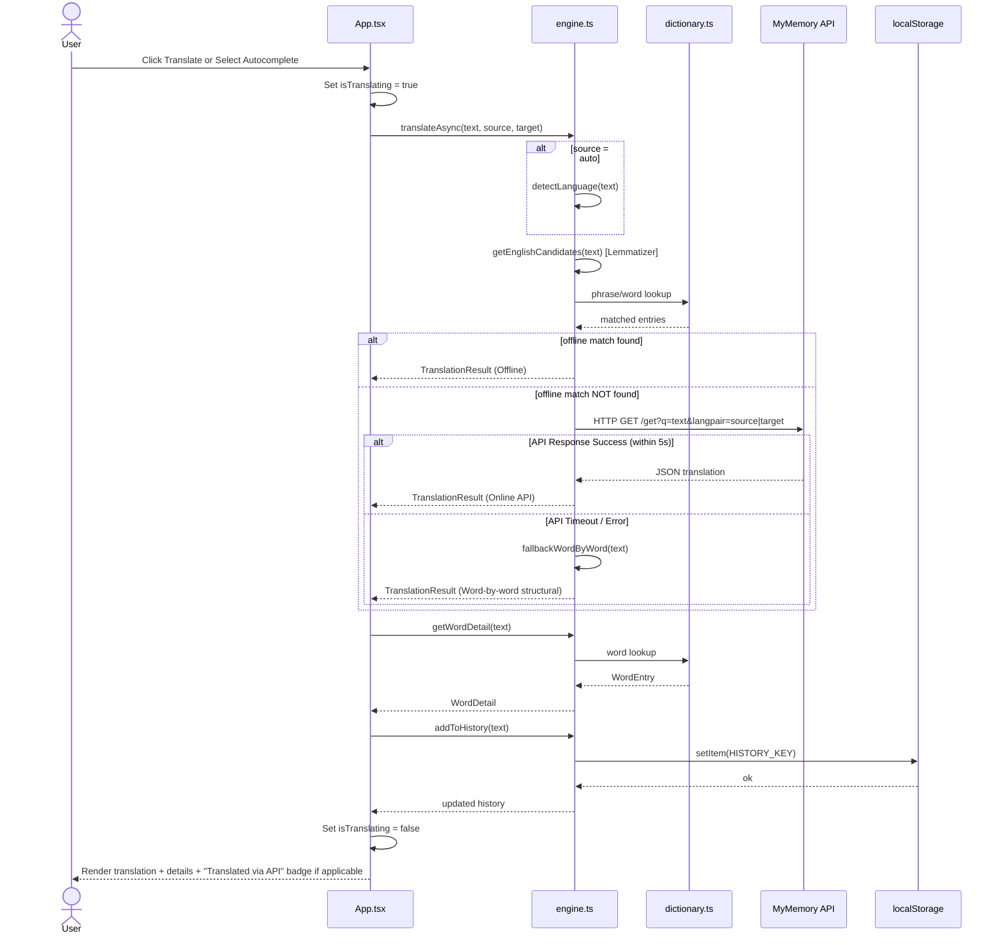
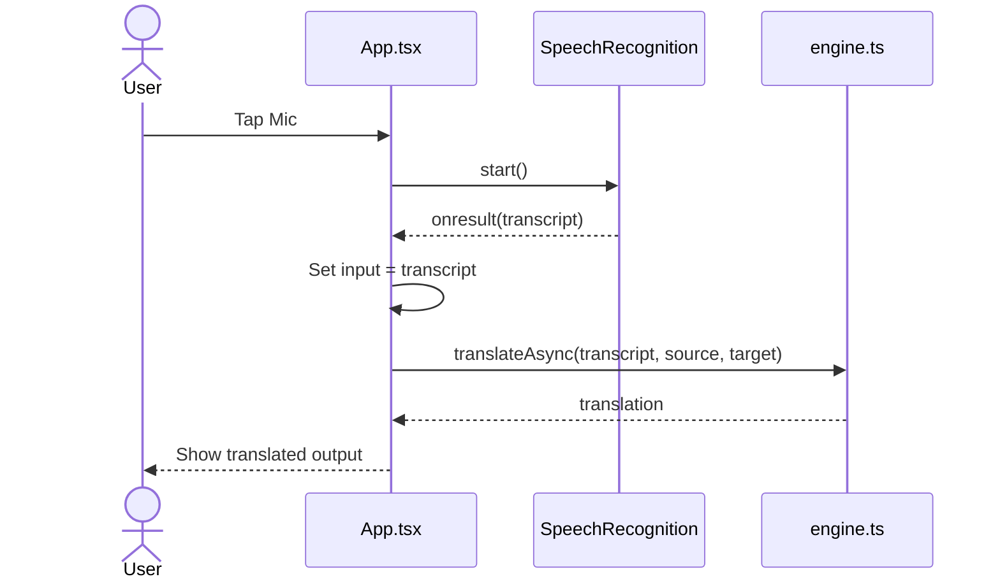
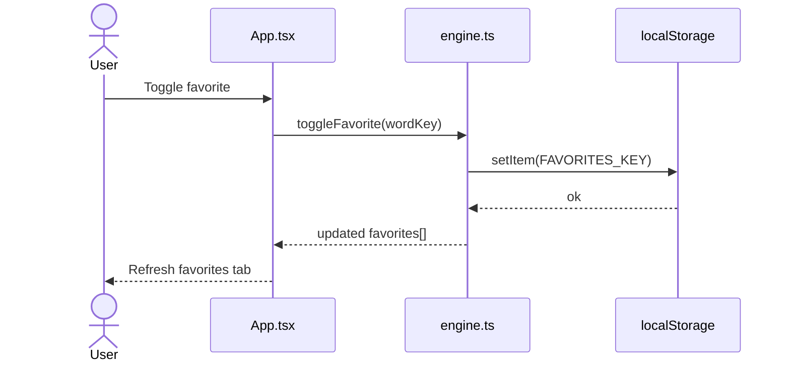

# Sequence Diagrams

## SD-01 Translate Request (Hybrid Offline/Online Fallback)

```mermaid
sequenceDiagram
    actor User
    participant App as App.tsx
    participant Engine as engine.ts
    participant Data as dictionary.ts
    participant API as MyMemory API
    participant Storage as localStorage

    User->>App: Click Translate or Select Autocomplete
    App->>App: Set isTranslating = true
    App->>Engine: translateAsync(text, source, target)
    
    alt source = auto
      Engine->>Engine: detectLanguage(text)
    end
    
    Engine->>Engine: getEnglishCandidates(text) [Lemmatizer]
    Engine->>Data: phrase/word lookup
    Data-->>Engine: matched entries
    
    alt offline match found
      Engine-->>App: TranslationResult (Offline)
    else offline match NOT found
      Engine->>API: HTTP GET /get?q=text&langpair=source|target
      alt API Response Success (within 5s)
        API-->>Engine: JSON translation
        Engine-->>App: TranslationResult (Online API)
      else API Timeout / Error
        Engine->>Engine: fallbackWordByWord(text)
        Engine-->>App: TranslationResult (Word-by-word structural)
      end
    end
    
    App->>Engine: getWordDetail(text)
    Engine->>Data: word lookup
    Data-->>Engine: WordEntry
    Engine-->>App: WordDetail
    
    App->>Engine: addToHistory(text)
    Engine->>Storage: setItem(HISTORY_KEY)
    Storage-->>Engine: ok
    Engine-->>App: updated history
    
    App->>App: Set isTranslating = false
    App-->>User: Render translation + details + "Translated via API" badge if applicable
```

## SD-02 Voice Input

```mermaid
sequenceDiagram
    actor User
    participant App as App.tsx
    participant SR as SpeechRecognition
    participant Engine as engine.ts

    User->>App: Tap Mic
    App->>SR: start()
    SR-->>App: onresult(transcript)
    App->>App: Set input = transcript
    App->>Engine: translateAsync(transcript, source, target)
    Engine-->>App: translation
    App-->>User: Show translated output
```

## SD-03 Favorites Update

```mermaid
sequenceDiagram
    actor User
    participant App as App.tsx
    participant Engine as engine.ts
    participant Storage as localStorage

    User->>App: Toggle favorite
    App->>Engine: toggleFavorite(wordKey)
    Engine->>Storage: setItem(FAVORITES_KEY)
    Storage-->>Engine: ok
    Engine-->>App: updated favorites[]
    App-->>User: Refresh favorites tab
```
