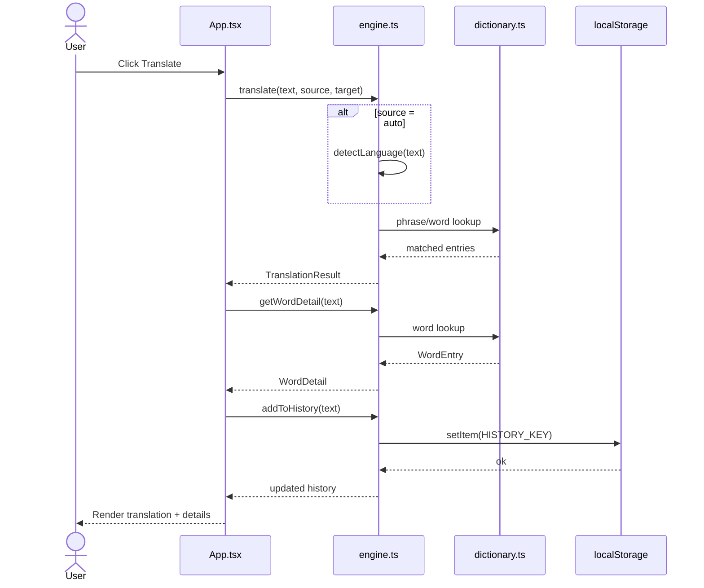
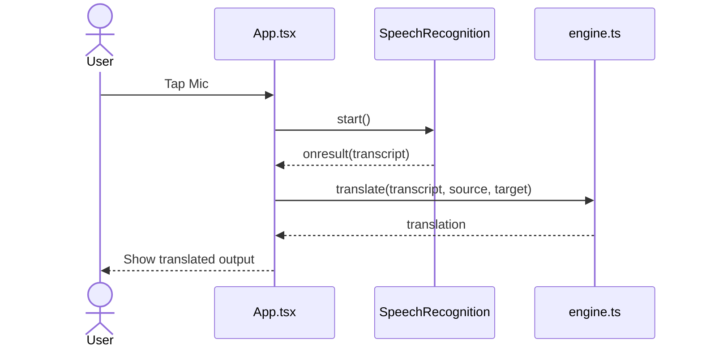
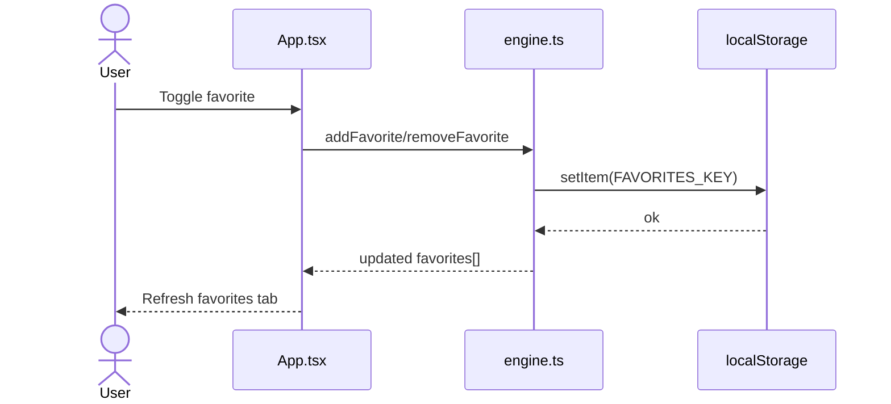

# Sequence Diagrams

## SD-01 Translate Request

```mermaid
sequenceDiagram
    actor User
    participant App as App.tsx
    participant Engine as engine.ts
    participant Data as dictionary.ts
    participant Storage as localStorage

    User->>App: Click Translate
    App->>Engine: translate(text, source, target)
    alt source = auto
      Engine->>Engine: detectLanguage(text)
    end
    Engine->>Data: phrase/word lookup
    Data-->>Engine: matched entries
    Engine-->>App: TranslationResult
    App->>Engine: getWordDetail(text)
    Engine->>Data: word lookup
    Data-->>Engine: WordEntry
    Engine-->>App: WordDetail
    App->>Engine: addToHistory(text)
    Engine->>Storage: setItem(HISTORY_KEY)
    Storage-->>Engine: ok
    Engine-->>App: updated history
    App-->>User: Render translation + details
```

## SD-02 Voice Input

```mermaid
sequenceDiagram
    actor User
    participant App as App.tsx
    participant SR as SpeechRecognition
    participant Engine as engine.ts

    User->>App: Tap Mic
    App->>SR: start()
    SR-->>App: onresult(transcript)
    App->>Engine: translate(transcript, source, target)
    Engine-->>App: translation
    App-->>User: Show translated output
```

## SD-03 Favorites Update

```mermaid
sequenceDiagram
    actor User
    participant App as App.tsx
    participant Engine as engine.ts
    participant Storage as localStorage

    User->>App: Toggle favorite
    App->>Engine: addFavorite/removeFavorite
    Engine->>Storage: setItem(FAVORITES_KEY)
    Storage-->>Engine: ok
    Engine-->>App: updated favorites[]
    App-->>User: Refresh favorites tab
```
