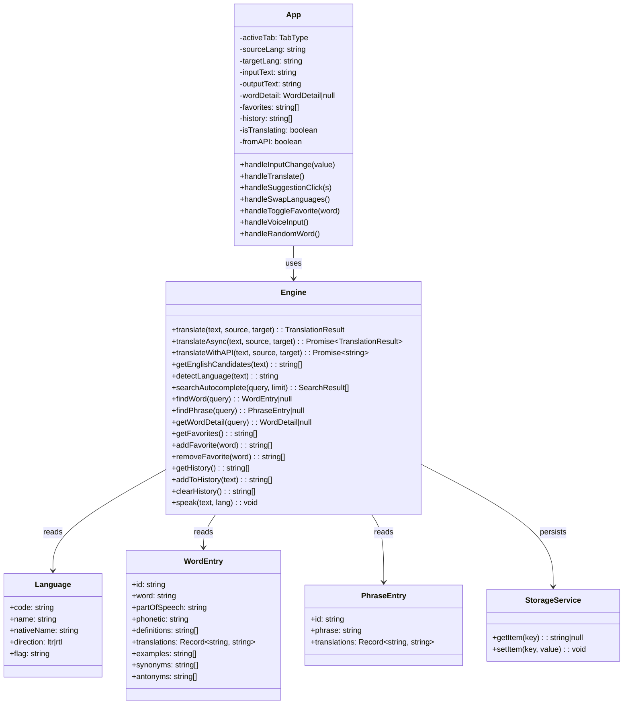

# Class Diagram

## UML (logical class view)

```mermaid
classDiagram
  class App {
    -activeTab: TabType
    -sourceLang: string
    -targetLang: string
    -inputText: string
    -outputText: string
    -wordDetail: WordDetail|null
    -favorites: string[]
    -history: string[]
    -isTranslating: boolean
    -fromAPI: boolean
    +handleInputChange(value)
    +handleTranslate()
    +handleSuggestionClick(s)
    +handleSwapLanguages()
    +handleToggleFavorite(word)
    +handleVoiceInput()
    +handleRandomWord()
  }

  class Engine {
    +translate(text, source, target): TranslationResult
    +translateAsync(text, source, target): Promise~TranslationResult~
    +translateWithAPI(text, source, target): Promise~string~
    +getEnglishCandidates(text): string[]
    +detectLanguage(text): string
    +searchAutocomplete(query, limit): SearchResult[]
    +findWord(query): WordEntry|null
    +findPhrase(query): PhraseEntry|null
    +getWordDetail(query): WordDetail|null
    +getFavorites(): string[]
    +addFavorite(word): string[]
    +removeFavorite(word): string[]
    +getHistory(): string[]
    +addToHistory(text): string[]
    +clearHistory(): string[]
    +speak(text, lang): void
  }

  class Language {
    +code: string
    +name: string
    +nativeName: string
    +direction: ltr|rtl
    +flag: string
  }

  class WordEntry {
    +id: string
    +word: string
    +partOfSpeech: string
    +phonetic: string
    +definitions: string[]
    +translations: Record~string, string~
    +examples: string[]
    +synonyms: string[]
    +antonyms: string[]
  }

  class PhraseEntry {
    +id: string
    +phrase: string
    +translations: Record~string, string~
  }

  class StorageService {
    +getItem(key): string|null
    +setItem(key, value): void
  }

  App --> Engine : uses
  Engine --> Language : reads
  Engine --> WordEntry : reads
  Engine --> PhraseEntry : reads
  Engine --> StorageService : persists
```

## Note
The code uses functional modules; this class model is a UML abstraction for design communication.
