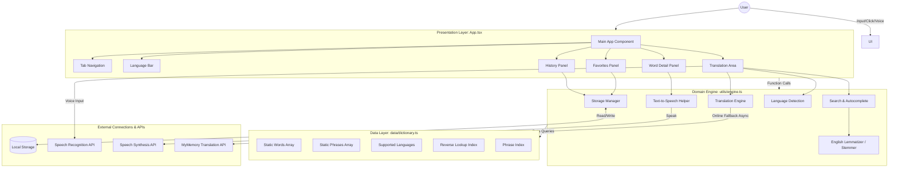

# System Architecture

## High-Level Architecture

## Architectural Layers

### 1. Presentation Layer (`src/App.tsx`)
- **Core Responsibility:** State management, tab routing, rendering UI components, and coordinate synchronous + asynchronous translation states.
- **Key Components:**
  - `LanguageBar`: Handles source/target language selection and swapping.
  - `TranslationArea`: Captures text/voice queries and renders the real-time translations along with "Translated via API" badges when fallbacks are used.
  - `WordDetailPanel`: Displays comprehensive word data (definitions, synonyms, parts of speech, antonyms, and pronunciation).
  - `FavoritesPanel` & `HistoryPanel`: Manages user-saved data and interaction history.

### 2. Domain / Service Layer (`src/utils/engine.ts`)
- **Core Responsibility:** Centralized business logic.
- **Key Modules:**
  - **Language Detection:** Identifies source language based on Unicode script ranges and dictionary lookups.
  - **Search & Autocomplete:** Implements prefix and exact phrase matching across multiple languages.
  - **English Lemmatizer & Stemmer:** Dynamic inflection engine (`getEnglishCandidates`) resolving regular plural nouns, third-person verbs, present participles, past-tense verbs, and common English **irregular verb inflections** (e.g., `"done"` $\rightarrow$ `"do"`, `"went"` $\rightarrow$ `"go"`, `"children"` $\rightarrow$ `"child"`).
  - **Translation Engine:** Operates a hierarchical fallback system:
    1. Try offline phrase match.
    2. Try offline single word match.
    3. Try offline word-by-word sentence fallback.
    4. Try online **MyMemory API fallback** over HTTP.
  - **Storage Manager:** Wraps `localStorage` with typed functions (`getFavorites`, `addToHistory`, etc.).
  - **Speech Helper:** Normalizes the Web Speech Synthesis API, handling browser-specific quirks.

### 3. Data Layer (`src/data/dictionary.ts`)
- **Core Responsibility:** Offline database.
- **Key Characteristics:**
  - Contains statically typed arrays of `words` (w001–w078), `phrases` (p001–p009), and `languages`.
  - Exposes initialization functions (`buildReverseIndex`, `buildPhraseIndex`) which are cached by the engine for O(1) lookups.

### 4. Persistence Layer (Browser Local Storage)
- Stores user-specific settings and data purely on the client side:
  - `dictionary_favorites`: JSON array of favorite word keys.
  - `dictionary_history`: JSON array of recently searched word keys.

## Runtime Characteristics
- **Offline-First Hybrid Architecture:** High-speed local processing for primary vocabulary, with instant fallback-querying to the free online MyMemory API for long sentences or missing keys.
- **Dynamic Inflection Support**: Automatically stems regular and irregular grammar, making local offline lookups vastly smarter and less dependent on exact string matches.
- **Native Browser Dependency:** Relies on Web Speech API (`SpeechRecognition` and `SpeechSynthesis`). If unsupported, the UI gracefully degrades.
