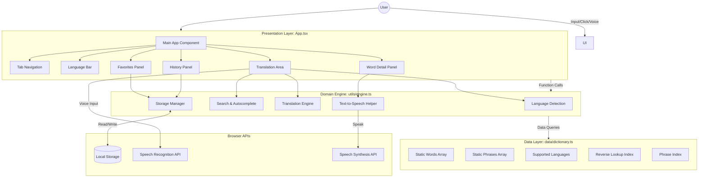

# System Architecture

## High-Level Architecture

## Architectural Layers

### 1. Presentation Layer (`src/App.tsx`)
- **Core Responsibility:** State management, tab routing, and rendering UI components.
- **Key Components:**
  - `LanguageBar`: Handles source/target language selection and swapping.
  - `TranslationArea`: Captures text or voice input and displays the real-time translation.
  - `WordDetailPanel`: Displays comprehensive word data (definitions, synonyms, parts of speech, etc.).
  - `FavoritesPanel` & `HistoryPanel`: Manages user-saved data and interaction history.

### 2. Domain / Service Layer (`src/utils/engine.ts`)
- **Core Responsibility:** Centralized business logic.
- **Key Modules:**
  - **Language Detection:** Identifies source language based on Unicode script ranges and dictionary lookups.
  - **Search & Autocomplete:** Implements fuzzy, prefix, and exact phrase matching across multiple languages.
  - **Translation Engine:** Handles word-for-word, exact phrase, and fallback translations.
  - **Storage Manager:** Wraps `localStorage` with typed functions (`getFavorites`, `addToHistory`, etc.).
  - **Speech Helper:** Normalizes the Web Speech Synthesis API, handling browser-specific quirks.

### 3. Data Layer (`src/data/dictionary.ts`)
- **Core Responsibility:** Offline database.
- **Key Characteristics:**
  - Contains statically typed arrays of `words`, `phrases`, and `languages`.
  - Exposes initialization functions (`buildReverseIndex`, `buildPhraseIndex`) which are cached by the engine for O(1) lookups.

### 4. Persistence Layer (Browser Local Storage)
- Stores user-specific settings and data purely on the client side:
  - `dictionary_favorites`: JSON array of favorite word keys.
  - `dictionary_history`: JSON array of recently searched word keys.

## Runtime Characteristics
- **Fully Offline:** Operates without any server calls (excluding initial asset load).
- **Deterministic Output:** Translation quality is strictly bound to the embedded dictionary definitions.
- **Native Browser Dependency:** Relies on Web Speech API (`SpeechRecognition` and `SpeechSynthesis`). If unsupported, the UI gracefully degrades.
